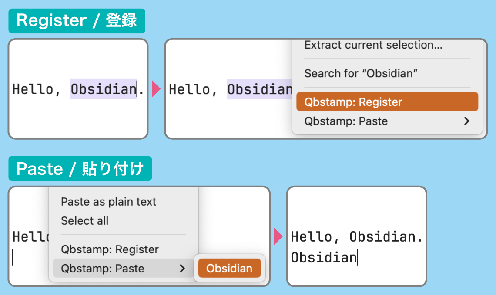
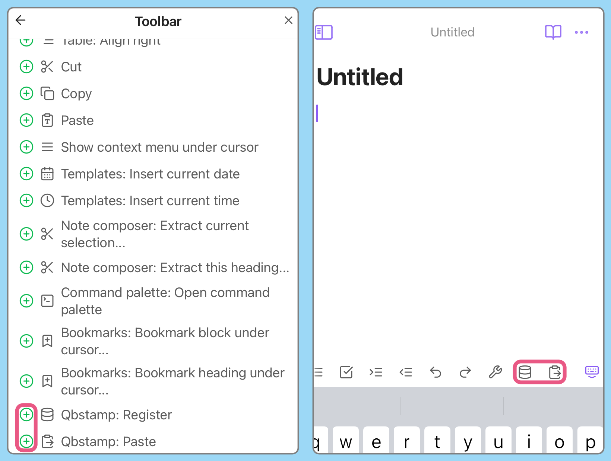

# About Plugin / プラグインについて

Add a feature to Obsidian that can register and paste any text.

<!-- prettier-ignore -->
任意のテキストを登録し貼り付けることができる機能をObsidianに追加します

# How to use / 使用方法

## Register and paste any text / 任意のテキストの登録と貼り付け

### Right-click menu / 右クリックメニュー

-   Register: Select the text you wish to register and register it from the menu.
-   Paste: Select Paste from the menu and select the item you wish to paste.

-   登録: 登録したいテキストを選択し、メニューから登録します
-   貼り付け: メニューから貼り付けを選択し、貼り付けたい項目を選択します

### Command / コマンド

It can also be operated from the command palette.  
Type “obstamp” in the search box.

コマンドパレットからも操作できます  
検索ボックスに「obstamp」と入力してください

### Mobile / モバイル

Register commands from “Settings” > “Toolbar” of Obsidian.

<!-- prettier-ignore -->
Obsidianの「設定」 > 「モバイルツールバー」からコマンドを登録してください

## Manage registered items / 登録した項目の管理

Items can be deleted and sorted from the plugin's settings.

プラグインの設定から項目の削除と並び替えができます

